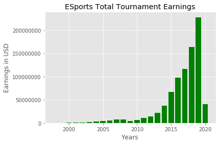
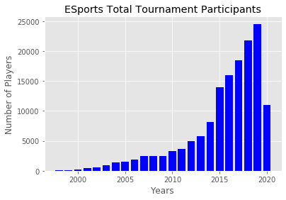
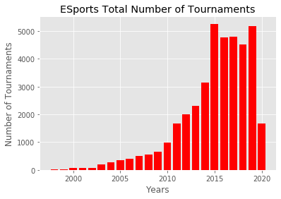
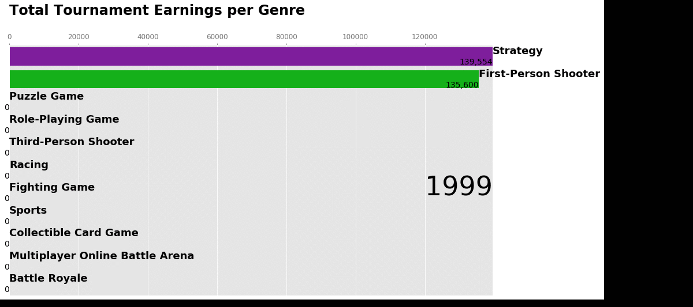
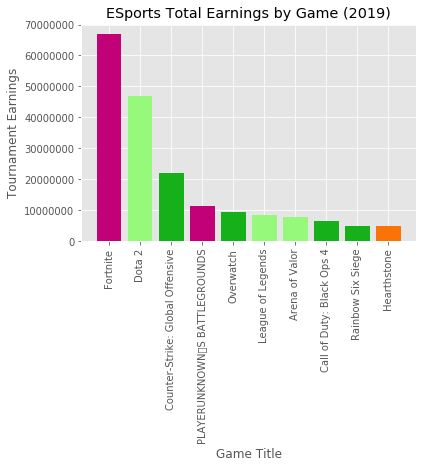

# ESports-Earnings
## A visualization of the ESports Tournament earnings from 1999 to 2020
Data source from:
https://www.esportsearnings.com/

With this project it was an aim to visualize the growth of the ESports world and all the tournaments out there.

## Totals over the years:

First I visualize the total number of cash prizes available over the years with simple bar charts, along with total number of participants and total number of tournaments.

## Bar Chart Race by genre:

Next I create a Bar Chart Race of all the genres total earnings from competitions.

## Totals for each game
Last I create a function that allows for the top 10 highest tournament winnings by each game over the last few years.

## e.g.:

Please view the full code at the .py file: ESports_Visualization.py

For a more complete description please few the Kaggle notebook which this was created on:
